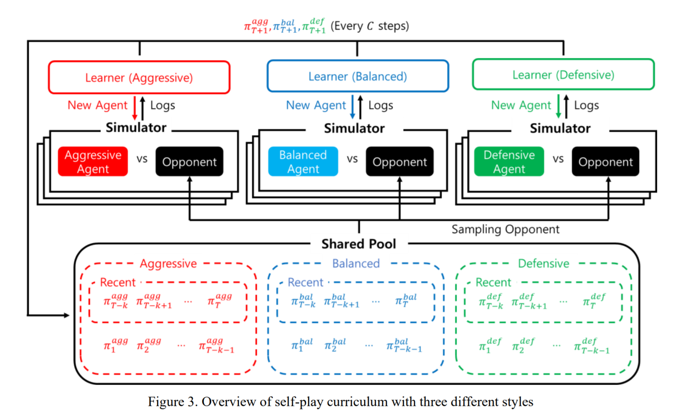

## Creating Pro-Level AI for a Real-Time Fighting Game Using Deep Reinforcement Learning

##### NC Soft, https://arxiv.org/pdf/1904.03821.pdf

### Introduction

강화학습은 Atari와 같은 PVE(player versus environment), Go나 Chess와 같은 PVP(player versus player) 와 같이 다양한 게임 장르로 확장되고 있으며, 최근에는 StarCraft2와 Quake3, Dota2와 같이 복잡한 비디오 게임의 PVP에 포커싱.
본 논문에서는 Blade & Soul(B&S) Arena Battle에서 최신 self-play 기반 강화학습을 통한 pro-level AI agents 개발.

- B&S Arena Battle
  - two player battle 시스템으로 two-player zero sum game
  - time step 별 144 개의 action space [8(avail skills) * 9(8 directional + no move) * 2(facing opponent or moving direction)]
  - skill 간 dependency 존재 (저항기와 no-op, no-op와 상태이상기, 상태이상기와 저항기 간)

### MDP Design

- 각 time step을 0.1초로 결정
- 여러 tick의 Observation을 LSTM 네트워크에 적용
- Observation
  - HP, SP
  - 적과의 거리
  - 벽 까지의 거리
  - 현재 위치
  - 잔여 게임 시간
  - 44 skill에 대한 잔여 cooldown
  - agent 의 상태(스턴, 그로기, 다운 등)
- Action
  - skill action (44 skill + no_op)
  - move or target action (4 move + no_op + 적과 반대방향 이동)
- Reward
  - Win reward + HP reward
  - HP reward = $(HP^{ag}_t + HP^{ag}_{t-1}) - (HP^{op}_t - HP^{op}_{t-1})$

### Self-Play Curriculum with Diverse Styles

- 다른 battle style에 대한 agent를 만들어 서로 대전하게 하는 self-play 기법 적용

- battle style을 aggressive, balanced, defensive로 나누고 해당 battle style에 대해 reward shaping 적용

- - |                  | Aggressive | Balanced | Defensive |
    | ---------------- | ---------- | -------- | --------- |
    | Time penalty     | 0.008      | 0.004    | 0.0       |
    | HP ratio         | 5:5        | 5:5      | 6:4       |
    | Distance Penalty | 0.002      | 0.0002   | 0.0       |

  

- 세가지 다른 스타일(공격형, 밸런스형, 수비형)의 agent를 shared pool에 모아 uniformly 하게 서로 대전하도록 self-play 구성

### Data Skipping Techniques

- agent 가 가능한 44 가지 skill 에 추가로 no-op action을 추가하여 학습하였는데, CC 기에 당했거나, skill cooldown 때문에 선택되는 no-op action은 학습에 활용하지 않음
- 0.1초 마다 action을 결정하도록 설계하였는데, 0.1초 간 agent가 움직일 수 있는 거리가 제한적이기 때문에 move action의 경우는 하나의 action을 선택했을 때 1초 간 같은 action을 수행하도록 함

### Implementation Details

- $\pi_{skill} , \pi_{move, target}, Q_{skill}, Q_{move, target}$ 을 학습하는 LSTM-based network 구성
- ACER(Actor-Critic with Experience Replay) 알고리즘 활용 
  - A3C(Asynchronous Advantage Actor-Critic)의 off-policy 버전
  - off-policy가 가능하기 위해 Importance sampling 기법 적용

### Pro-Gamer Evaluation

- 인간과의 공정함을 위해 action 마다 평균 230ms의 delay를 줌
- Destroyer class 간 대전만 진행하고 skill set을 인간이 정한 것으로 맞추게끔 함

### Evaluation Result

- 세가지 스타일의 agent가 2015, 2016 챔피언과 2017 챔피언과의 pre-test 대전 후 2018 대회에서 Blind match를 진행

  |             | Aggressive | Balanced  | Defensive |
  | ----------- | ---------- | --------- | --------- |
  | Pro-Gamer 1 | 5-1        | 2-1       | 1-2       |
  | Pro-Gamer 2 | 4-0        | 2-4       | 4-1       |
  | Blind Match | 2-0        | 1-2       | 0-2       |
  | Total       | 11-1 (92%) | 5-7 (42%) | 5-5 (50%) |

  