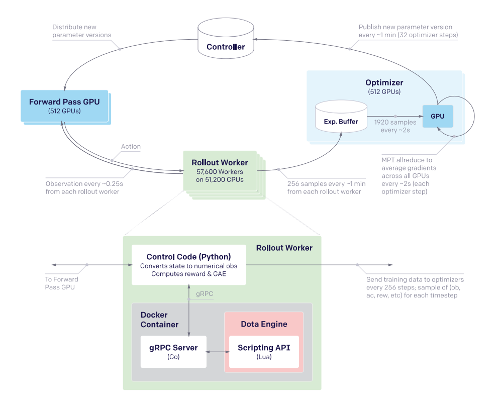
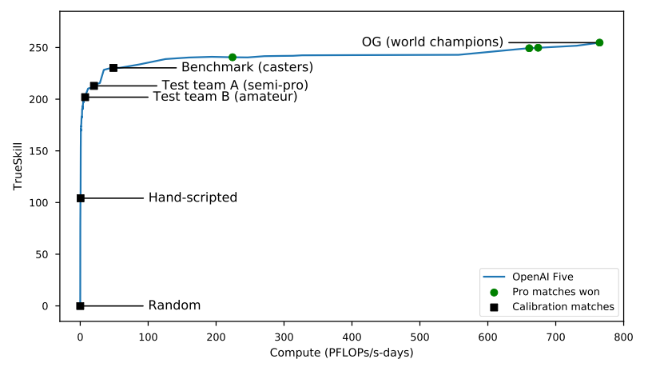
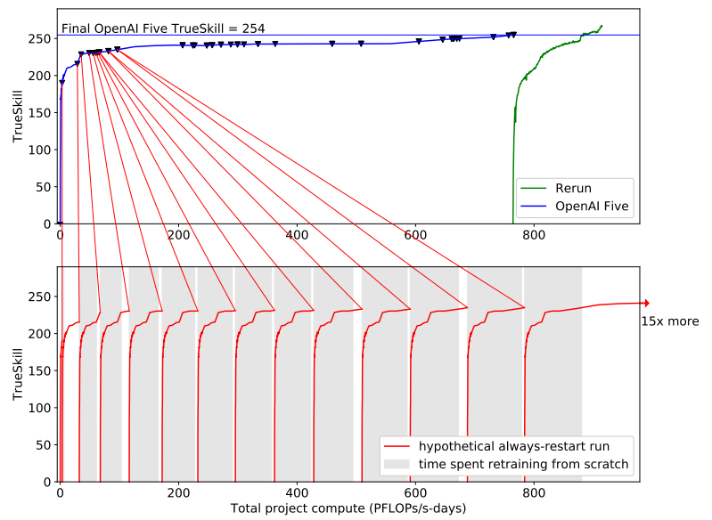
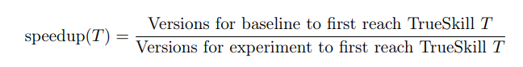
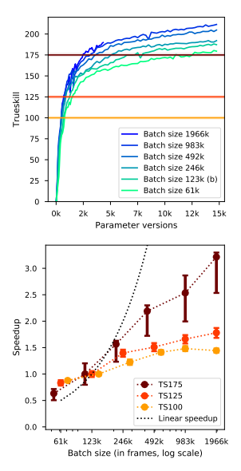

## Dota 2 with Large Scale Deep Reinforcement Learning

##### OpenAI, https://arxiv.org/pdf/1912.06680.pdf

### Introduction
- real-world 문제에 대한 도전은 AI 분야의 오랜 목표
- Backgammon, Chess, Atari, Go 등의 게임을 Reinforcement Learning을 통해 해결
- 본 논문에서는 longtime horizon, partially observation, high dimensionality observation and action 환경인 Dota 2를 Reinfocement 를 통해 해결하고자 함
- Dota 2 agent인 OpenAI Five는 Dota 2 world champion 인 OG team를 물리쳤고, 이후 community에 대전 가능하도록 공개하여 7000 게임에서 99.4% 승률 달성
- OpenAI Five 개발 동안 계속해서 코드와 환경이 변했기 때문에 surgery라고 불리는 최소한의 loss로 훈련을 계속 지속할 수 있는 방식 제안

### Dota 2
- Long time horizons
  - Dota 2는 30Hz로 거의 45분간 진행
  - OpenAI Five는 4 frame 마다 action을 선택하기 때문에 20,000 정도의 step 진행 (Chess: 80 step, Go: 150 step)
- Partially-observed state
  - 각 팀은 unit이나 건물 근처의 일부만 game state로 볼 수 있음
- High-dimensional action and observation state
  - Dota 2는 10 heroes, 12 buildings, 12 non-player units, game features(runes, trees, wards, ...) 들 때문에 최대 16,000개의 observation space 존재
  - action space 또한 8,000 ~ 80,000 정도로 Chess의 경우 1,000, Go의 경우 6,000 action space
- limitations from regular game
  - OpenAI Five는 117개 영웅 중 17개 활용
  - player가 일시적으로 동시에 multiple unit을 컨트롤하는 아이템 제외

### Training System
#### Playing Dota using AI
- OpenAI Five는 4 frame 마다 movement, attack 등으로 embedding 된 discrete action 결정
- item이나 ability 구매, courier unit 컨트롤과 같은 부분은 hand-script logic으로 처리
- policy는 action probability distribution을 결정하도록 설계하고 4096-unit LSTM을 활용해서 총 159 million parameter 학습
- 
- pixel on the screen을 observation으로 활용하는 대신 set of data arrays를 활용
- 이렇게 하는 이유는 두 가지 이유가 있는데
  - 첫 번째로 visual processing 에 집중하는 대신 strategic planning and high-level decision making에 대한 연구에 집중하기 위함
  - 두 번째로 모든 training game에서 각 frame을 rendering 하는 것이 불가능에 가까움
  
#### Optimizing the Policy
- human experts에 대항하기 위한 policy를 찾는 것이 목적
- 처음에는 캐릭터 사망, 자원 습득 등에 대한 reward function을 최대화 하는것을 연습하고 zero sum game을 감안해 적 팀의 reward 점수를 빼는 것 적용
- policy는 Proximal Policy Optimization 사용
- optimization으로 Generalized Advantage Estimation 사용
- 학습 네트워크는 중앙에 LSTM을 두고 policy, value로 갈라지게끔 구성 
- 
- 학습 시스템은 다음과 같고 Dota2 self-play 3experience를 활용하여 학습 수행
- 중앙의 GPU는 비동기적으로 experience buffer를 저장하고 NCCL2를 통해 동기적으로 parameter gradient update
- total batch size는 1 step 당 300만개이며 Adam Optimizer 활용
- Rollout worker는 self-play game을 real-time 2배 가속으로 구동
- self-play policy 적용 전략은 최신 policy로 전체의 80% 게임을 구동하고 20%는 old policy로 구동
  
#### Continual Transfer via Surgery
- 프로젝트 진행 도중, code 나 environment가 3가지 이유로 지속적으로 변화됨
  1. 학습과 실험 중에 reward structure, observation, policy network 변경 등 학습 process를 변경시킬 일 발생 
  2. 시간이 지남에 따라 agent의 action, observation space를 확장시킬 일이 발생
  3. 시시 각각 Dota 2 game의 영웅, 아이템, 지도 등에 대한 업데이트 발생
- 본 논문에서는 surgery라고 하는 새로운 환경에서 old policy를 통해 다른 크기와 의미를 가진 new policy로 성능이 저하되지 않도록 이식하는 offline operation 제안
- 이는 Net2Net-style의 transformation이며, 본 논문에서 10달 간 학습 동안 성능저하 없이 20번 이상의 surgery 수행
  
### Experiments and Evaluation
- OpenAI Five는 10개월 동안 300백만 배치사이즈(AlphaGo에 비해 50~150배 정도 큰 배치사이즈)를 가지고 150백만 파라미터를 학습
#### Human Evaluation
- OpenAI Five는 학습 이후, 수많은 아마추어와 프로 게이머, 프로 팀과 대전하고 4월 13일에 Dota 2 world champion인 OG team과 경기하여 2-0의 결과로 승리
- 4월 18-21 온라인 대전에서는 3,193팀과 7,257경기를 해 99.4% 승률 달성
- Dota2에서 사람의 게임 피지컬(human dexterity)을 측정할 수 있는 요소는 reaction time으로, Dota 2의 reaction time은 217ms(일반적인 사람이 250ms 정도)
- OpenAI Five를 학습하는 동안 agent를 자동으로 평가하기 위한 방법이 필요했고, TrueSkill rating system 적용
  - 여기서 TrueSkill이란 Elo rating(플레이어 실력이 정규 분포 한다는 가정 하에 실력을 매기는 척도)를 개선하여 플레이어의 실력이 정규 분포 하지 않다고 가정하고 실력을 매기는 방식
  - 
  - 즉, 이 그래프를 봤을 때 각 대전 상대마다 TrueSkill score가 있고(Hand-script 100, world champions over 250) 이를 이겼을 경우 이정도의 TrueSkill score를 달성했다고 볼 수 있음
- OpenAI Five의 playstyle에 대해서는 확실하게 정의하기 어렵지만, 학습 진행과정에 따라 게임을 접근하는 방식으로 논함
  - 학습 초기에는 한타 위주의 전투를 일으킴. 때문에 보통 20분 내 승리하거나 45분 이상 지속될 경우 패배 
  - agent 개선 이후 일반적인 사람의 play처럼 초반에 자원을 습득하며 영웅을 키우는 데에 집중하고 한타
  - 마지막 agent의 경우 사람과 거의 유사했지만 몇 가지 다른점이 있었는데 
  사람은 라인에 영웅을 배치하면 잘 안바꾸지만 OpenAI Five는 훨씬 자주 포지션을 움직이고
  사람은 체력이 적을 경우 조심하는 경향이 있지만 OpenAI Five는 체력이 적을 때 본인에게 공격할 것을 알고 희생을 감수하는 듯한 행동을 보임
  마지막으로 OpenAI Five는 cooldown이 있는 능력에도 사람보다 훨씬 더 많이 자원을 소비 
#### Validating Surgery with Rerun
- 본 논문에서 제시한 surgery가 리소스를 얼마나 절약하는지 검증하기 위해 두 번째 agent를 두어 최신 버전으로만 학습을 다시 수행하고 이것을 "Rerun"이라 부름
- 
- 그래프에서 확인 하는 것과 같이 surgery 변화보다 확연하게 성능 복구가 느린것 확인 가능 (surgery 없이 학습을 수행했다면 10달이 아니라 40달 정도 소요 예측)
- 또 다른 surgery의 장점으로 모든 시간 구간에서 좋은 성능의 agent로 evaluation이 가능
- Rerun의 경우 전체 OpenAI Five의 20% 근접한 리소스 소모
#### Batch Size
- 작은 규모의 실험에서 batch size 증가가 어느정도 효과가 있는지 평가 진행
- batch size를 증가시킨다는 것은 두 가지 의미를 가짐
  1. 큰 batch 를 optimize 하기 위해 GPU를 2배 이상 사용한다는 것
  2. 2배 이상 sample을 생성해내기 위해 foward GPU와 rollout machine을 2배 이상 사용한다는 것
- batch size를 증가시킬 때 비교할 수 있는 강력한 요소는 linear한 속도 향상 : 2배의 compute 자원을 활용했을 때 동일 skill 수준으로 1/2배 빨리 도달
- 
- 
- Rerun의 경우 baseline의 2.5배의 batch size를 활용해 superhuman 성능에 도달하기 까지 2달 소요됐는데 baseline 수준의 batch size였을 때 5달 소요 될 것으로 예상
#### Data Quality
#### Long term credit assignment

### Related Work

### Conclusion