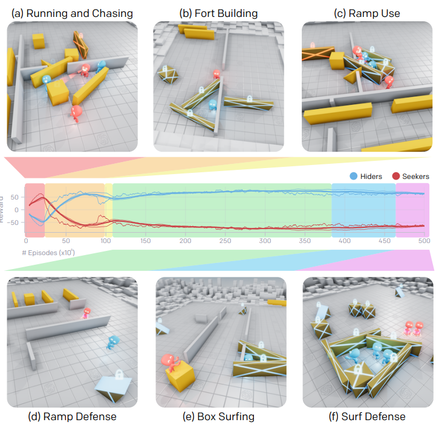
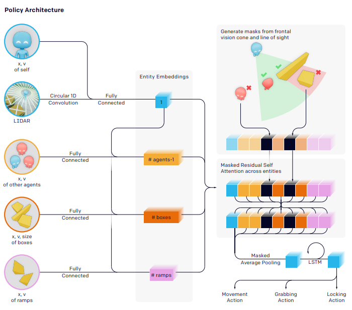

## Emergent Tool Use From Multi-Agent Autocurricula

##### OpenAI, https://arxiv.org/pdf/1909.07528.pdf

### Introduction
- 물리세계에서 인간처럼 물체와 상호작용할 수 있는 에이전트를 만드는 하나의 접근 방법으로 강화학습이 있음
- 하지만, reward function을 명세하거나 trajectories를 모으는 비용이 비쌈
- 이를 해결하기 위해 비지도적인 exploration을 종용하는 intrinsic motivation 방법이 있음
- 하지만 이는 인간의 진화과정과 다름
- 본 논문에서는 hide-and-seek 게임을 하는 경쟁, 적대적 환경 소개 
- 에이전트는 오직 visibility-based reward function만 가지고 경쟁하며 에이전트의 의도에 따라 적합한 tool 사용 방법을 학습함
- 예를들어 hider는 seeker를 피해 여러개의 forts를 활용하여 바리케이트를 구성하고 seeker는 이에 따라 비탈길을 이용해 바리케이트 안으로 점프함
- 이는 intrinsic motivation 방법보다 더 인간적으로 해석할 수 있는 행위 도출
- 
- 본 논문의 메인 contribution은 다음과 같음
  1. 다양한 에이전트 전략 상황에서 multi-agent self-play가 autocurricula 창발
  2. 물리 기반 환경에서 multi-agent autocurricula는 tool 활용과 같은 인간적인 전략 유도
  3. 개방형 환경 뿐만 아니라 도메인에 적합한 타겟 지능 테스트를 위한 transfer 제안
  4. multi-agent autocurricula 학습을 위한 오픈 소스 기반 환경 배포

### Related Work
- multi-agent self-play에 대한 설명
- intrinsic motivation 방법에 대한 설명
  - count-based exploration : visit count를 세 안가본 곳으로 exploration
  - transition-based method : transition에 대한 예측 error를 통해 exploration
  - RL을 활용한 tool use 연구 설명
  
### Hide And Seek
- two team physics 기반 hide-and-seek 환경에서 학습 수행
- hider는 seeker의 시야를 피하는 것이 목적이고 seeker는 반대로 hider를 주시하는 것이 목적
- agent는 모든 hider가 시야에 없으면 +1, 어떤 hider든 seeker에게 걸리면 -1로 팀 단위 reward를 받고(seeker의 경우 반대 케이스로 reward) map에서 너무 멀어질 경우 -10
- episode는 240 timestep이고 처음 40% 시간 동안은 0 reward
- 시뮬레이션은 MUJOCO 물리 엔진 기반이며 1 to 3 hider, 1 to 3 seeker, 3 to 9 randomly objects로 구성
- action은 xyz move와 grab, lock으로 구성

### Policy Optimization
- 적당한 수준의 opponents와 self-play를 통한 학습 수행
- PPO(Proximal Policy Optimization) + GAE(Generalized Advantage Estimation) + rapid(large-scale distributed RL framework) 활용
- CTDE(centralized training decentralized execution)으로 학습하고 실행 단계에서 각각의 agent는 본인의 observation만 활용
- 
- 자신의 상태를 ego-centric 하게 embedding하고 나머지 agents를 embedding
- residual self-attention 구조 활용

### Auto-Curricula And Emergent Behavior
- 학습 초기에, hider와 seeker는 단순하게 도망가고 추격하는 것을 학습
- 25백만 에피소드 이후, hider는 box와 같은 tool을 활용하여 쉘터를 만들어 숨는 방법 학습
- 75백만 에피소드 이후, seeker는 비탈길을 이용하여 장애물을 뛰어 넘어 hider의 쉘터에 침입하는 것을 학습
- 이후 10백만 에피소드 이후, hider는 다시 비탈길을 막기 위해 map 가장자리에 비탈길을 옮겨놓고 lock을 검
- 380백만 에피소드 이후, seeker는 lock 걸린 비탈길에 박스를 가져가 그 박스에 올라타 쉘터를 침입하는 행위 발현
- 결국 hider는 쉘터를 만들기 전 모든 box와 비탈길을 lock 하는 것을 학습
- defualt model의 batch size는 64,000 1.6백만 parameters, 132.3백만 에피소드, 비탈길 방어까지 34시간 이상 학습 소요
- optimization 단계에서는 32,000 배치 사이즈 활용하고 16,000, 8,000 배치사이즈에서는 수렴하지 않음

### Evaluation
- 많은 unsupervised rl 방법과 같이, 최적화의 목표가 학습된 행동에 직접적인 이점이 아니기 때문에 이러한 행동을 평가하는 것은 무의미
- 또한 multi-agent 환경에서 reward를 tracking 하는 것은 모호하여 ELO 혹은 Trueskill 방식으로 성능지표를 세우는 것이 조금 더 적절하지만 이것 또한 학습 성능 향상이나 개선에 대한 지표로는 보기 어려움
#### Comparision to Intrinsic Motivation
- intrinsic motivation은 

### Discussion and Future work