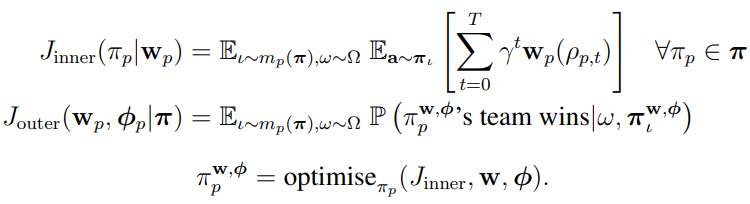

## Human-level performance in first-person multiplayer games with population-based deep reinforcement learning

#### DeepMind, https://arxiv.org/pdf/1807.01281&hl=en&sa=X&d=15122523080710664267&scisig=AAGBfm3w_xBhB1LUjM_5wJ--G5MJuW5YSQ&nossl=1&oi=scholaralrt

### Introduction
- reinforcement learning은 복잡한 single-agent environment에서 좋은 성과를 거뒀지만, multiple agents가 포함 된 real-world에서는 도전적으로 남음
- 본 논문에서는 human-level의 3D multi player video game인 Quake 3 Area Capture the Flag에서 오직 pixel input만으로 RL 도입
- 실험 결과는 지능형 에이전트의 능력이 human-level intelligence에 확연히 가까워 졌음을 나타냄
- 본 논문은 복잡한 multi-agent 환경에서 새로운 agent의 지능적 행위 창발이 어떻게 일어나는지를 보임

- 본 논문의 실험 환경은 modify 된 Quake 3 Area 환경인 Capture the Flag mode에서 진행
- partially observable한 multi-agent environments에서 다양한 agent population이 학습하기 때문에 학습 과정의 안정성 때문에 meta-optimisation 제안
- 이는 win/loss signal의 sparse한 delayed reward를 internal reward signal로 해결
- feature에 대해 multi-scale representation으로 long-term temporal reasoning 이 가능한 구조 제안

### Agent's Policy

- agent's policy를 human player와 동일한 인터페이스를 가지도록 raw RGB pixel input과 game pad action 활용
- agent의 policy parameter는 external memory를 활용한 multi-timescale recurrent neural network 고려
- 일반적인 hierarchical RL agent가 명시적인 hierarchical goals or skill에 대한 구조인 반면 본 논문의 agent는 좀 더 hierarchical temporal representation과 sequential data를 위한 recurrent latent variable model과 연관이 있음
- 본 논문에서는 agent's policy가 N player 게임에서 각자의 팀의 승리를 위한 policy를 학습해야 한다고 가정

- 하지만 게임 결과뿐인 reward signal은 너무 sparse 하기 때문에 학습이 안될 수 있어, 게임 결과보다 좀 더 빈번한 time 별 reward 필요
- 본 논문에서는 게임을 이기기 위한 dense internal reward function 명세

### Training
- agent가 각자 own policy를 가지고 self-play를 함으로써 training에 필요한 experience 획득 가능
- 하지만 multi-agent game에서 self-play는 unstable 하며 확장성에 필요한 동시 학습을 지원하지 않음
- 본 논문에서는 parallel하게 다른 policy를 가지는 agent들에 대한 population을 가지고 학습을 진행
- 이를 internal rewards 및 hyperparameter를 학습하기 위한 meta-optimise 방법으로도 활용
- 또한 tow-tier reinforcement learning problem으로 생각할 수 있는데, inner의 경우 objective function inner를 최적화 하고 outer의 경우 meta-game, 즉 internal reward와 hyperparameter를 최적화 하기 위한 최적화 진행

- inner optimisation은 RL을 활용하고 outer optimisation은 Population Based Training 활용
- generalisation performance를 위해 3가지 type의 agents를 구성하여 map을 생성하고 tournament를 진행하며 학습 수행
  
### Result and Analysis

### Conclusions