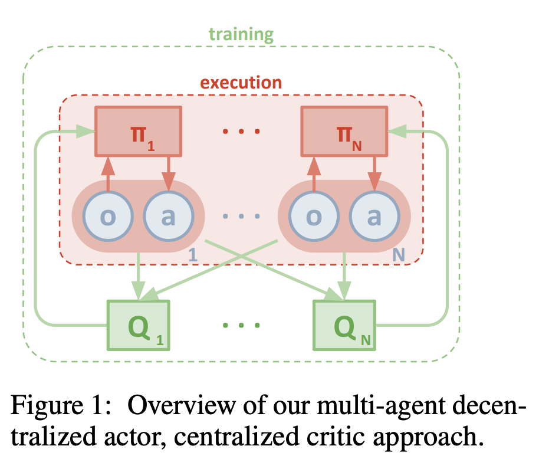
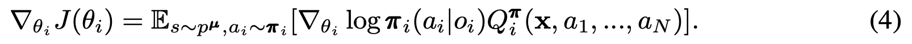
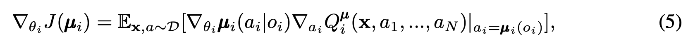
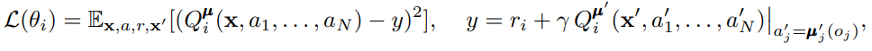
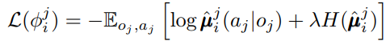
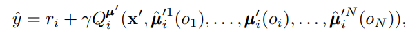
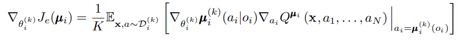
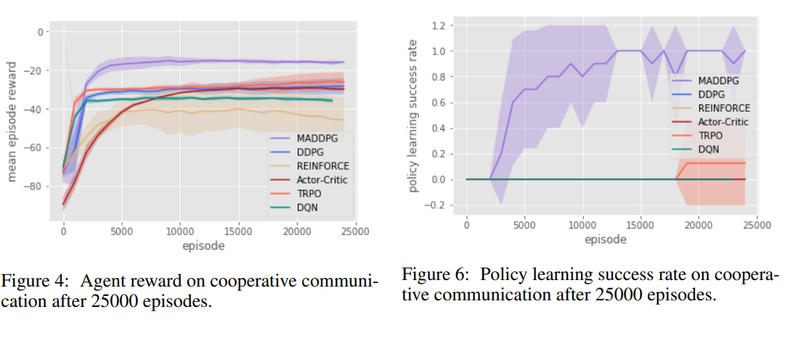
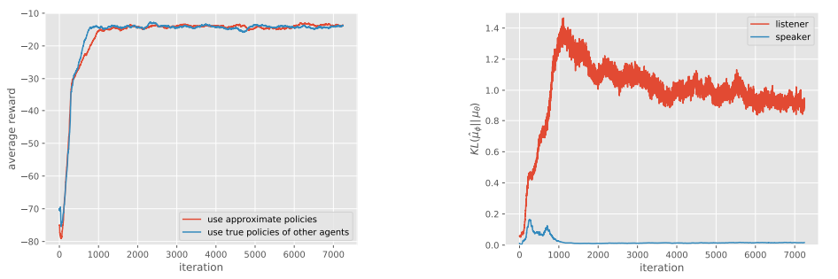
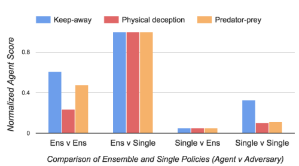

## Multi-Agent Actor-Ciritic for Mixed Cooperative-Competitive Environments (MADDPG)

##### OpenAI, https://arxiv.org/pdf/1706.02275.pdf

### Introduction

현재 강화학습은 game playing to robotics, data center와 같은 large scale systems 등 single agents 환경에서 성공을 거둠
하지만 multi-robot control, multiplayer games, discovery of communication and language 등의 multiple agent 간 interaction을 포함한 환경에 대한 강화학습 도입이 중요
본 논문에서는 범용 목적을 가진 multi-agent 강화학습 알고리즘 제안

- 실행 단계에서 오직 local information을 활용한 policy 학습 진행
- agent 간 통신을 위한 동적이거나 특정 구조를 가정하지 않는 모델
- cooperative interaction 뿐만 아니라 competitive 혹은 mixed interaction 까지 적용한 알고리즘
- Centralized training with decentralized execution(CTDE)를 차용
- 기본적으로 actor-critic 구조인데 critic의 경우 다른 agents 들의 policies 정보를 추가로 사용하고 actor의 경우 오직 local information 만 활용
- ensemble of policies를 통해 안정적으로 multi-agent의 policies에 대한 improve 방법 제시

### Related Work

- ​

### Background

- Markov Games (MDP) 설명
- Q-Learning and Deep Q-Networks (DQN) 설명
- Policy Gradient (PG) Algorithms 설명
- Deterministic Policy Gradient (DPG) Algorithms 설명

### Methods

#### Multi-Agent Actor Critic

- centralized training with decentralized execution의 구조를 가지고 있기 때문에 training 단계에서 policies를 학습 할 때 extra information 활용 가능
- Q-learning에서 training 과 test 단계에 다른 추가 information을 포함하는 것이 적절하지 않기 때문에 다른 agents의 policies information을 critic에 추가하여 actor-critic 구조를 간단하게 확장

- 목적함수는 다음과 같은 구조를 가짐
- $Q_i^\pi(x, a_1, ..., a_N)$ 은 모든 agents의 actions과 state x(x = o_1, ..., o_N)을 입력으로 가지는 centralized action-value function

- 이를 continuous 환경의 deterministic policy로 변환하면 다음과 같은 목적함수가 됨

#### Inferring Policies of Other Agents

- 목적함수를 최대화 하기 위한 loss function과 Q function으로 agents의 actions들을 고려한 식을 제안하는데, 실 생활에서는 다른 agents의 action(policy)을 알 수 없을 수 있기 때문에 이를 근사할 수 있는 방법 제시

- policy parameter phi를 통해 근사 된 다른 agent의 policy를 가지고 entropy regularizer term을 이용한 policy gradient loss 식 제안

#### Agents with Policy Ensembles

- 경쟁적 multi-agent 환경에서 경쟁 agent의 전략이 바뀜으로 인해 학습하고자 하는 agent의 전략에 대한 policy 변경이 overfitting으로 인해 불안정할 수 있음
- K개의 sub-policy를 두어 episode 마다 랜덤하게 policy를 선택하고 이를 ensemble 하는 방식 활용

### Experiments 

#### Environments 

- 실험 환경으로 OpenAI MPE 환경 활용 (https://github.com/openai/multiagent-particle-envs)
- Multi-agent Particle Environment
  - Cooperative Comunication
    Speaker가 지정한 landmark로 listner가 이동
  - Predator-Prey
    Predator agent group이 Prey group을 잡아먹는 환경
  - Cooperative navigation
    set of L의 landmarks를 agent 끼리 상대 위치를 확인하며 이동
  - Physical Deception
    협력적 agent group 과 적대적 agent group 이 서로 N개의 landmark를 선점하기 위해 이동

#### Comparison to Decentralized RL Methods

- MADDPG method가 DDPG, REINFORCE, Actor-Critic, TRPO, DQN 보다 좋은 성능을 냄

#### Effect of Learning Policies of Other Agents

- True policy 활용과 approximating policy에 따른 성능 저하가 거의 없음

####Effect of Training with Policy Ensembels

- 학습 대상 agent가 ensembel policy, adversary가 single policy일 때 nomalized reward 가 가장 높음

### Conclusions and Future Work

- 모든 agent에 대한 Q function은 input space 에 대한 linear 한 성능 저하를 일으킬 수 있기 때문에 neighborhood agents에 대한 modular Q function에 대한 향후 연구 진행