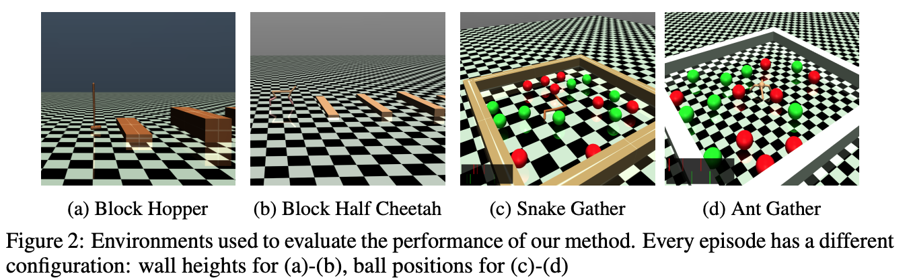

## Sub-Policy Adaptation for Hierarchical Reinforcement Learning

##### UC Berkeley, https://arxiv.org/pdf/1706.05296.pdf

### Introduction
- Reinforcement Learning 분야는 Go나 Pong과 같은 game, automating robotic locomotion, dexterous manipulation 등 다양한 분야에 적용
- Hierarchical reinforcement learning은 Reinforcement Learning에서 모듈 간 추상화와 재사용 등에 대한 한계를 극복하기 위한 하나의 방법
- 본 논문에서는 temporal hierarchies에 지속적으로 적용 가능한 framework 제시 및 효과적인 hierarchical policy gradient 근사 식 유도
- manager와 sub-policy 간 decoupling 을 보여주고 sub-policy의 특정 baseline 제시하며 stable gradient 식인 HiPPO(Hierarchical Proximal Policy Optimization) 알고리즘 제시

### Preliminaries
- 본 논문에서 discrete-time finite-horizon discounted Markov decision process 제안
- tuple은 다음과 같이 구성 
- S는 state set, A는 action set, P : S X A X S -> R+ 인 transition probability distribution
- 감마는 discount factor, H는 horizon
- 
- zt는 manager policy에 대한 pi_theta(zt | st) sample
- p라는 정적 시간 구간을 정하고 kp 부터 (k+1)p - 1 까지 구간에서 zkp에 따른 sub-policy pi_theta(at | st, zkp)를 통한 at sampling
- 본 논문에서는 hierarchical policy를 학습하고 얼마나 효율적으로 모든 레벨에서 이를 적용할 수 있는지 연구
- high-level policy(manager)와 low-level policy(sub-policy)가 존재하고 n sub-policy에 대해 선택할 수 있는 z = Zn에 중점을 둠

### Related Work
- 전통적인 HRL에 대한 설명과 최근에 continuous space 문제에 접근한 내용 언급
- Option framework에 대한 설명과 최근에 continuous space 문제에 접근한 내용 언급

### Efficient Hierarchical Policy Gradients
- 본 논문에서 첫 번째로 hierarchical policy gradient가 latent variable 변화 없이 정확하게 근사할 수 있는지 증명
- 두 번째로 varience estimate를 줄이기 위한 unbiased baseline policy gradient 유도
- 마지막으로 sub-policy collapse를 막으면서 모든 레벨에서 policy joint가 가능한 on-policy hierarchical policy gradient algorithm인 HiPPO 제시
#### Approximate Hierarchical Policy Gradient
- 
- policy gradient 방적식은 다음과 같음
- 여기서 1/N은 sub-policy의 개수를 의미하고 H는 time horizon을 의미함
- 따라서 n개의 sub-policy 중 하나를 선택한 뒤 h step 만큼의 보상 기대치에 따라 policy gradient를 update 하는 것으로 파악
- 
- trajectories에 대한 probability는 다음과 같음
- 
- 보조 정리는 다음과 같고 appendix에 수학정 증명이 나오지만 맨 뒤에 수식 관찰 값으로 치환 가능한 증명에 대해 이해하지 못함..
#### Unbiased Sub-Policy Baseline
- log-likelihood ratio 트릭을 통한 policy gradient는 variance가 큼
- 이를 줄이기 위해 return에서 추정치를 빼는 것이 일반적인 방법
- 본 논문에서는 approximate gradient에서 unbiase한 baseline 제시
- 
- lemma1과 lemma2를 적용하여 최종적인 policy gradient expression을 이끌어 낼 수 있음
- 

#### Hierarchical Proximal Policy Optimization
- appropriate step size를 크게 하는 것은 policy learning stable에 ciritical
- TRPO 알고리즘은 KL-divergence를 통해 이러한 점을 해결하지만 Hierarchi 구조는 KL-divergence로 표현할 수 없는 복잡한 분산으로 이루어짐
- 때문에 계층적 구조에서는 PPO가 더 안정적이고 계산 효율적
- PPO Objective function에 계층적 구조를 적용하면 다음과 같음
- 

#### Varying Time-Commitment
- 대부분의 계층적 구조가 lower-level skill에 대해 fixed time-commitment을 부여하거나 option framework 활용
- 본 논문에서는 fixed distribution time 구간 중 샘플링 된 무작위 시간으로 새로운 task 결정 제시
- 알고리즘의 sudo 코드는 다음과 같음
- 

### Experiments
- 본 논문에서 다음과 같은 대답을 얻기 위한 실험을 설계
1. 밑 바닥부터 학습 시 flat policy와 비교하여 HiPPO의 성능 비교
2. 학습 environment 변경에 대한 policy robustness 검증
3. 미리 학습 된 skill에 대한 적응
4. 기술 다양성에 대한 가정 검증
#### Tasks
- 다양한 robotic locomotion과 navigation task에서 본 논문의 접근 평가
- 
- 2a-2b는 Hopper와 Half-Cheetah robot이 랜던한 높이의 벽들을 점프하기 위해 보행 학습을 위한 Environment
- 2c-2d는 LIDAR-type sensor를 가지고 bomb(red ball)을 피해 apple(green ball)을 모으는 Environment
이는 sparse reward 환경에서 perception, locomotion, higher-level planning 능력을 계층적 구조로 학습하기 위한 과제
#### Learning From Scratch and Time-Commitment
- 
- 위의 그림은 밑바닥 부터 학습 시 HiPPO가 flat PPO 보다 학습 속도가 더 빠름을 나타냄
- action 반복이 있는 PPO가 HiPPO보다 수렴이 늦은 것으로 보아 HiPPO가 단지 시간 상관관계에 대한 이점만 가지고 있지 않음
- 
- skill conditioned baseline을 활용했을 때 single baseline보다 좋은 성능을 보임
#### Comparison to Other Methods
- 
- 본 논문에서는 계층적 구조 state-of-the-art methods인 HIRO, Option-Critic, MLSH, HierVPG와 비교
- Block Half Cheetah 환경을 제외하고는 모두 HiPPO가 우세
#### Robustness to Dynamics Perturbations
#### Skill Diversity Assumption

### Conclusions and Future work