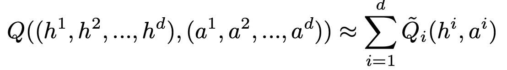
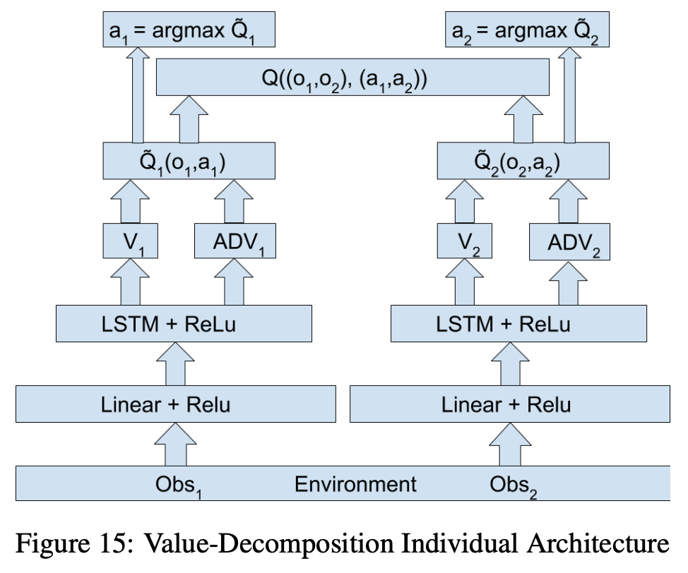
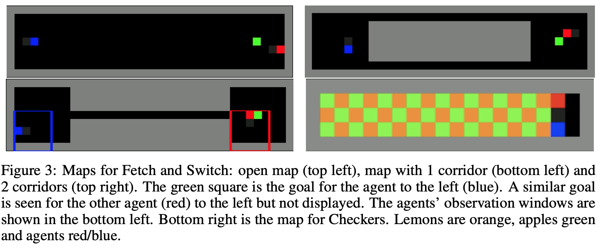
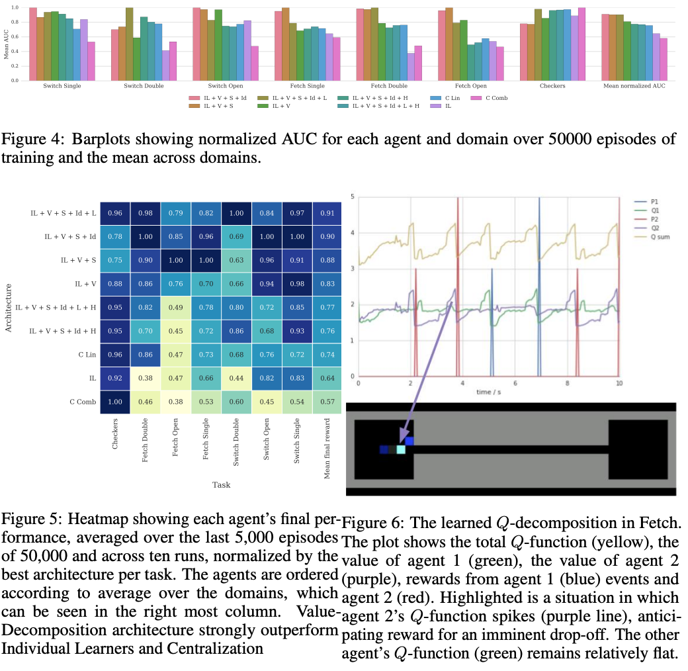

## Value-Decomposition Networks For Cooperative Multi-Agent Learning

##### DeepMind, https://arxiv.org/pdf/1706.05296.pdf

### Introduction

- MARL을 풀기위한 방법으로 jointly optimize a single reward 등 활용
- Coordinated MARL 문제는 self-driving vehicles, traffic signals, transportation system, productivity of a factory 와 같은 문제에 적용
- 본 논문에서는 학습 대상 agents 중 특정 agent가 유용한 policy를 학습하고 있을 때, 다른 agents 의 policy를 통한 experiments가 이 agent에 대해서는 안좋은 방향의 explorartion이 될 수 있기 때문에 발생하는 "lazy" 현상에 대한 centralised approach의 비효과적인 policy 학습을 보여줌
- 대안적 접근으로는 independent learners를 학습시키는 방식이 있는데, 이것은 동적인 환경에서 불안정한 문제를 직면할 수 있음
- 본 논문에서는 개인 agents에 대한 additive value-decomposition 학습 방법 제안
- 이 value decomposition network는 team reward signal을 통한 optimal linear value decomposition을 위함

### Background

- 일반적인 Reinforcement Learning에 대한 설명
- Deep Q-Learning에 대한 설명
- Multi-Agent Reinforcement Learning에 대한 설명
  Joint reward를 활용하는 Dec-POMDP에 대한 설명

### A Deep-RL Architecture for Coop-MARL

- 본 논문에서는 agents 간 부가적인 decomposed를 할 수 있는 joint-action value function을 만들고 활용

- $Q^~_i$ 은 오직 agents의 local observation만 활용하고 agents 의 Q 합을 최대화 하는 joint action을 취하는 central arbiter와 동일
-  learning parameter를 줄이기 위한 방법으로, agent 간 특정 network를 공유
- 이는 agent 불변성(invariance)를 늘리고 lazy agent problem을 피하기 위함
- 특정 시스템을 최적화 하기 위해 agent의 role information을 제공
  1-hot encoding을 통해 identity 정보를 observationr과 concatenate 

### Experiments

#### Agents

- Experience replay data를 활용하는 LSTM based Dueling DQN 알고리즘 활용
- Convolutional network를 활용하지 않고 observation정보를 바로 fully connected 하여 linear layer 활용
- LSTM + ReLU activation function, Adam optimizer 활용
- Q(s, a) = V(s) + A(s, a)로 advantage function 사용

#### Environments

- 2D grid world 기반 환경
- observation : 작은 시야를 가지는 3 x 5 x 5 RGB channel 
- action : step forward / backward / left / right, rotate left / right, use beam, stand still로 8개
  - Switch
    좁은 복도를 이용하여 다른 쪽의 goal 로 이동하는 게임
  - Fetch
    two agents가 같은object를 집어 point에 가져다 놓는 게임
  - Checker
    lemon(orange), apple(green) 칸을 지정하고 한 agent는 apple칸에 10점 lemon칸에 -10점, 다른 agent는 lemon에 1점, apple에 -1점에 대한 reward를 받는 게임

#### Results

- value-decomposition architecture를 활용한 것이 가장 성능이 좋음
- Fetch 환경에서 network weights parameter 공유가 lazy problem에 대해 가장 이득
- IL(indivisual learner), V(value decomposition), S(shared weights), Id(role information), L(lower-level communication), H(higher-level communication), C(centralization) 구조를 각각 조합하여 실험

#### The Learned Q-Decomposition

- Fetch 환경에서 $Q^~_1$, $Q^~_2$ function은 각 agent1, agent2 에 대한 분해된 Q function 이고 이는 각 agent에 대한 reward로 반영되는데 sum으로 이루어진 total Q function을 통해 이를 공유할 수 있다는 것을 Figure-6를 통해 확인 가능

### Conclusions

- 본 논문은 오직 하나의 joint reward가 주어진 상황에서의 cooperative multi-agent reinforcement learning에 대한 연구 진행
- value-decomposition network는 복잡한 문제를 local의, 빠른 sub-problem으로 자율적으로 분해할 수 있음
- 향후 team-size로 스케일을 키운, 복잡한 문제에 대한 연구 진행
